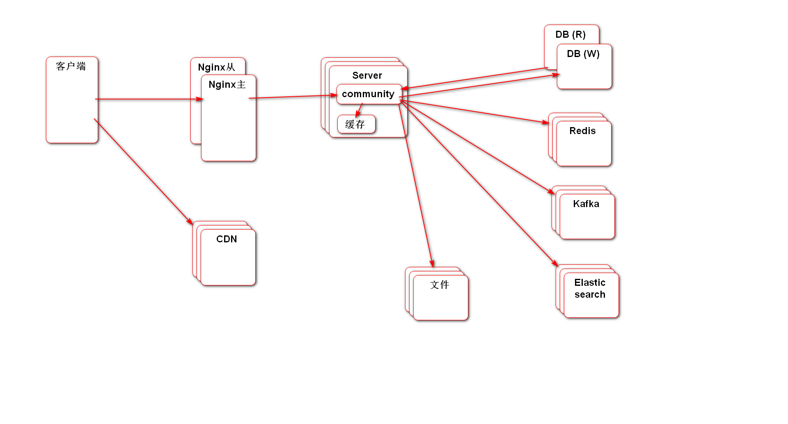
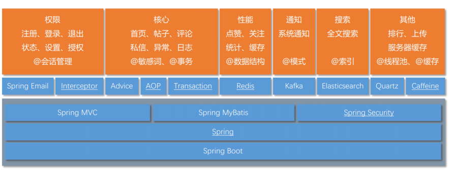

# community

This is my first project-BBS.

整体网络架构图：

技术概括：

+ 项⽬构建在Spring Boot+SSM框架之上，并统⼀的进⾏了状态管理、事务管理、异常处理；
+ 利⽤Redis实现了点赞和关注功能，单机可达5000TPS； - 利⽤Kafka实现了异步的站内通知；
+ 利⽤ElasticSearch实现了全⽂搜索功能，可准确匹配搜索结果，并⾼亮显示关键词；
+ 利⽤Caffeine+Redis实现了两级缓存，并优化了热⻔帖⼦的访问，单机可达8000QPS。
+ 利⽤Spring Security实现了权限控制，实现了多重⻆⾊、URL级别的权限管理；
+ 利⽤HyperLogLog、Bitmap分别实现了UV、DAU的统计功能，100万⽤户数据只需M级别的内存空间；
+ 利⽤Quartz实现了任务调度功能，并实现了定时计算帖⼦分数、定时清理垃圾⽂件等功能；
+ 利⽤Actuator对应⽤的Bean、缓存、⽇志、路径等多个维度进⾏了监控，并通过⾃定义的端点对数据库连接进 ⾏了监控。
